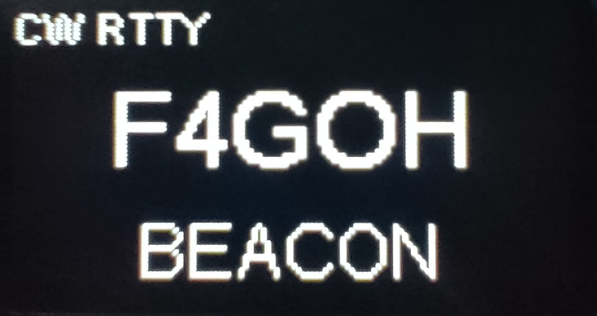
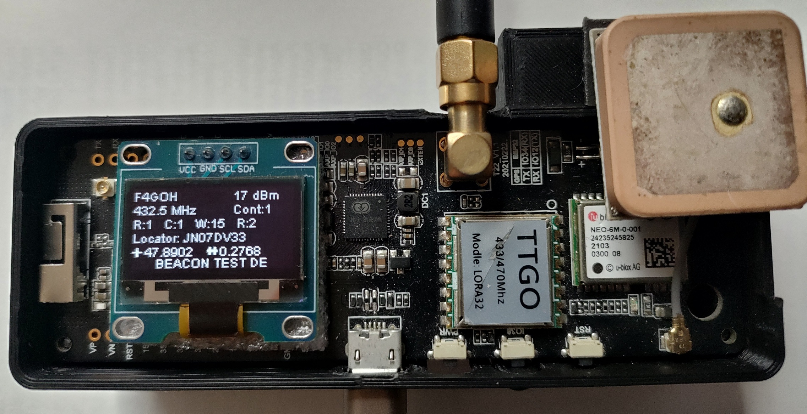
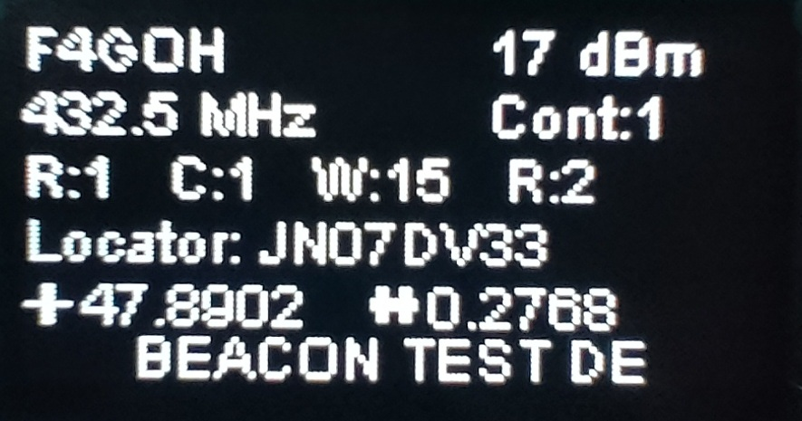
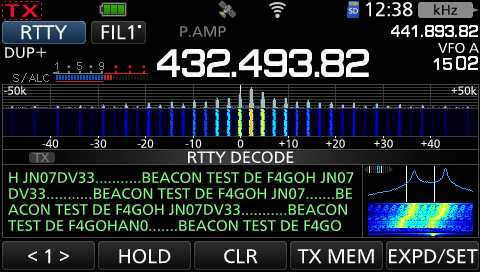
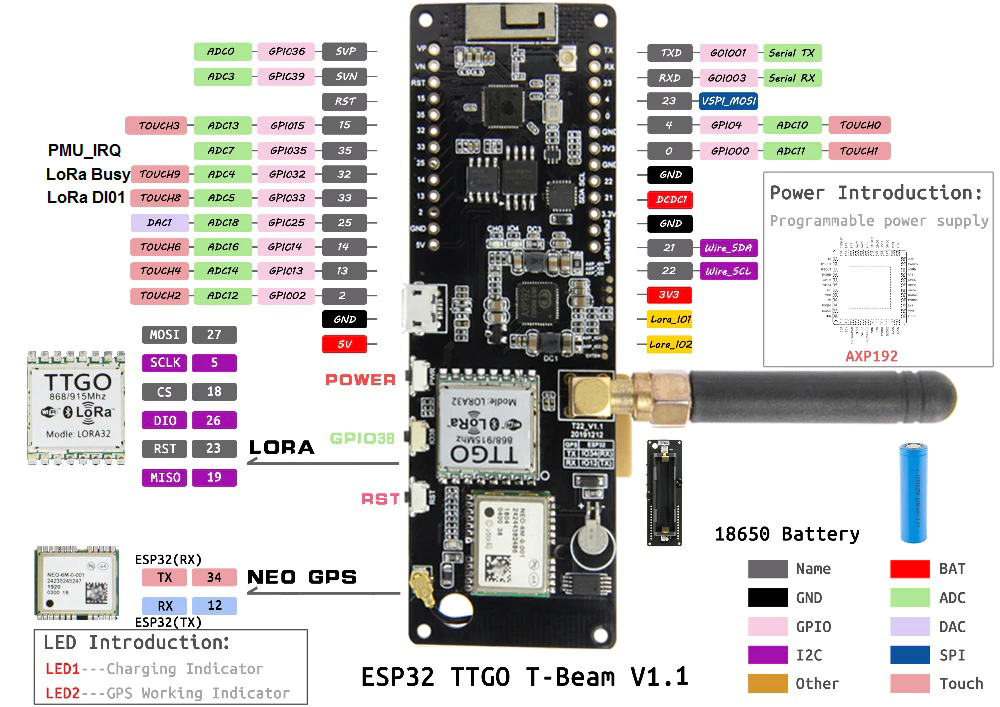
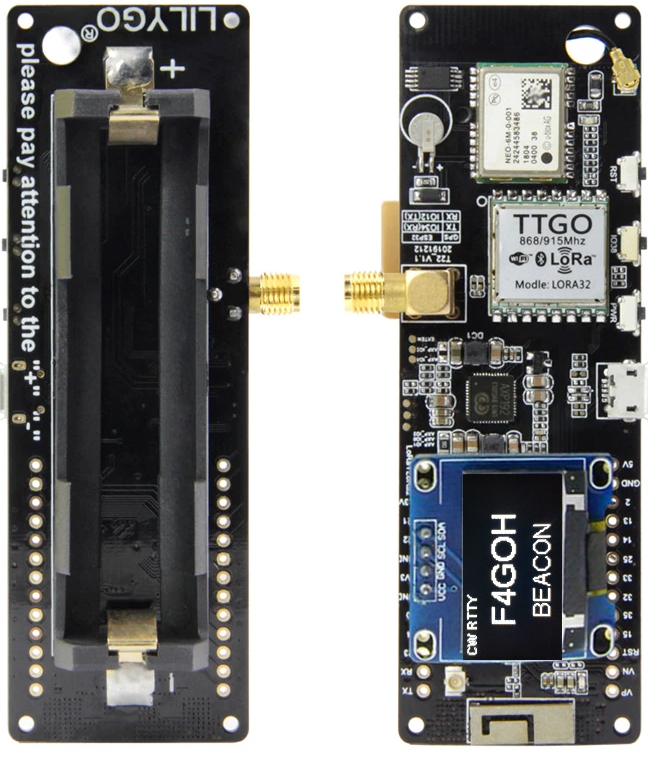
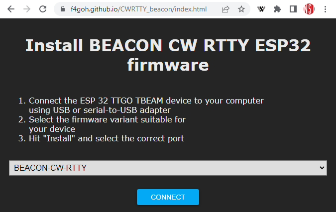

# CW RTTY Beacon with LoRa ttgo TBEAM module

A LoRa module is a small radio chip that can be used to send wireless messages. Normally, it uses a special modulation called LoRa, but thanks to a library like RadioLib, you can make it use other radio modulations, like CW (Morse code) and RTTY (45 bauds, shift 170 Hz).





## Main screen with all config



In this configuration :

- the transmission mode is continuous (Cont:1) (no GPS synchronisation) 
- rtty is active (R:1)
- CW is active (C:1) with a WPM of 15
- Each CW and RTTY frame is repeated 2 times (R:2)
- The frame sent will be "BEACON TEST DE F4GOH JN07DV33".

## Decoding RTTY (45 bauds , 170Hz shift)



## ESP32 pinout





## Automatic [firmwares](https://f4goh.github.io/CWRTTY_beacon/index.html) installation in the esp32 (no compilation)



## Config menu with serial terminal

To configure a TTGO module, we recommend using a serial terminal (such as PuTTY, Tera Term or the Arduino IDE serial interface).

- Set the communication speed to 115200 bauds

- Standard settings: 8 data bits, 1 stop bit, no parity, no flow control

On start-up, send the character m to access the menu. After 10 seconds, the beacon enters transmission mode.

```console
>Press m key to enter menu
..help command for info

>help
Available commands
Set new callsign                   : call F4GOH
Set frequency                      : freq 432500000
Set power dBm                      : setpwr 17
Set second txing into the minute   : second 20
Set new comment                    : comment HELLO
Set Rtty enable (0 or 1)           : setrtty 1
Set CW enable (0 or 1)             : setcw 1
Set Wpm (5..25)                    : setwpm 15
Set Repeat (1..3) nb repeat        : setrepeat 1
Set Continous  mode                : setcont 1
Show configuration                 : show
Reset default configuration        : raz
Exit menu                          : exit
>

>show
Call is              : F4GOH
Frequency is         : 432500000
Power is             : 17 dBm
Comment is           : BEACON TEST DE
Transmit at second   : 10
Rtty is              : Enable
CW is                : Enable
WPM is              : 15
Repeat is            : 2
Continous mode       : 1
>

>exit
>
 Console exit
Initialisation du module LoRa en mode FSK/OOK...
Puissance définie !
432500000
432.50
RTTY success!
CW success!
Init terminée
12:13:33
JN07DV33
BEACON TEST DE F4GOH JN07DV33 
```


